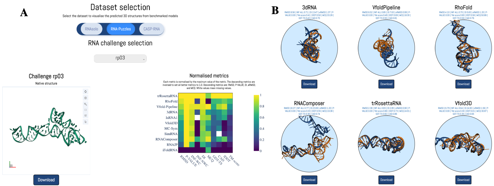

# State-of-the-RNArt website

This repository is the source code for the website State-of-the-RNArt. 



## Installations


### Locally
You need to have `python 3.10` installed. 

You can create a virtual environment, and then use:
```
pip install -r requirements.txt
```

### Docker
You can also use docker to run the website.

To do so, you have to build the image and then run it and expose the port `8050` using:

```
docker build -t state_of_the_rnart_website
docker run -it -p 8000:8000 -v ${PWD}/src/data:/app/src/data state_of_the_rnart_website
```

## Run

To run the program, you can use:

```
gunicorn --chdir src dash_helper:server -b :8000
```

## Citation

If you use this code, please cite the following paper:

```
State-of-the-RNArt: benchmarking current methods for RNA 3D structure prediction
Clément Bernard, Guillaume Postic, Sahar Ghannay, Fariza Tahi
bioRxiv 2023.12.22.573067; doi: https://doi.org/10.1101/2023.12.22.573067
```
