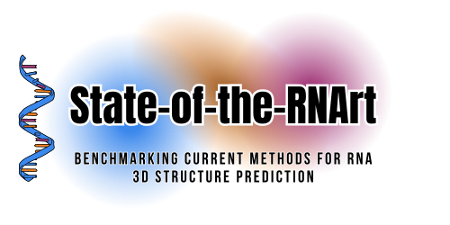
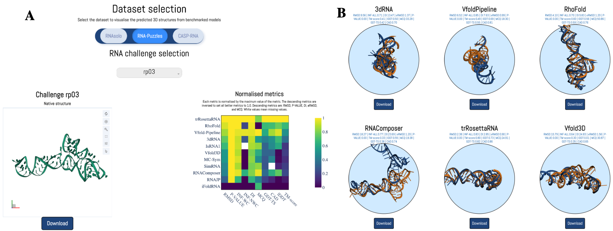

<div align="center">
<a href="https://doi.org/10.1093/nargab/lqae048" target="_blank" title="Go to article"></a>
<a name="readme-top"></a>

# State-of-the-RNArt website

This repository is the source code for the dashboard of [https://evryrna.ibisc.univ-evry.fr/RNARt/](State-of-the-RNArt)
<br> It also contains the aligned structures for each prediction for the <br> three test sets: `RNA_PUZZLES`, `CASP_RNA` and `RNASOLO`.

[![Article][article_img]][article_url]
[![License][repo_license_img]][repo_license_url]


<a href="https://doi.org/10.1093/nargab/lqae048" target="_blank" title="Go to article"></a>
<a name="readme-top"></a>


[![Update][update_img]][update_url]


We included predictions from `AlphaFold 3` as well as 10 other methods. 

</div>


# State-of-the-RNArt website

This repository is the source code for the website State-of-the-RNArt. 



## Installations


### Locally
You need to have `python 3.10` installed. 

You can create a virtual environment, and then use:
```
pip install -r requirements.txt
```

### Docker
You can also use docker to run the website.

To do so, you have to build the image and then run it and expose the port `8050` using:

```
docker build -t state_of_the_rnart_website
docker run -it -p 8000:8000 -v ${PWD}/src/data:/app/src/data state_of_the_rnart_website
```

## Run

To run the program, you can use:

```
gunicorn --chdir src dash_helper:server -b :8000
```


## Citation

If you use this code, please cite the following paper:

```
Clément Bernard, Guillaume Postic, Sahar Ghannay, Fariza Tahi, 
State-of-the-RNArt: benchmarking current methods for RNA 3D structure prediction, 
NAR Genomics and Bioinformatics, Volume 6, Issue 2, June 2024, lqae048, 
https://doi.org/10.1093/nargab/lqae048
```

Or using the bibtex format:

```bibtex
@article{Bernard2024,
  author = {Clément Bernard and Guillaume Postic and Sahar Ghannay and Fariza Tahi},
  title = {State-of-the-RNArt: benchmarking current methods for RNA 3D structure prediction},
  journal = {NAR Genomics and Bioinformatics},
  volume = {6},
  number = {2},
  pages = {lqae048},
  year = {2024},
  month = {June},
  doi = {10.1093/nargab/lqae048},
  url = {https://doi.org/10.1093/nargab/lqae048}
}
```

<!-- Links -->

[article_img]: https://img.shields.io/badge/NAR_Genomics_and_Bioinformatics-Article-blue?style=for-the-badge&logo=none
[article_url]: https://doi.org/10.1093/nargab/lqae048
[repo_license_img]: https://img.shields.io/badge/license-Apache_2.0-red?style=for-the-badge&logo=none
[repo_license_url]: https://github.com/EvryRNA/state_of_the_rnart_viz/blob/main/LICENSE
[update_img]: https://img.shields.io/badge/Update_May_2024-AlphaFold3-green?style=for-the-badge&logo=none
[update_url]: https://github.com/EvryRNA/state_of_the_rnart_website/blob/main
